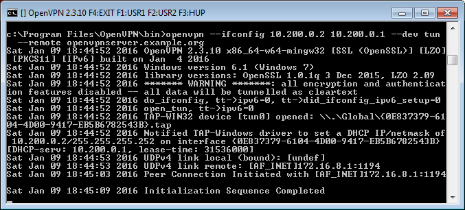

# Сети Точка-точка

В этой главе мы рассмотрим следующее:
* Минимально допустимые настройки
* Секретные ключи OpenVPN
* Несколько секретных ключей
* Туннель открытого текста
* Маршрутизация
* Конфигурационные файлы в сравнении с командной строкой
* IP-минимальная конфигурация
* Полная настройка между местоположениями
* Трехсторонняя маршрутизация
* Использование IPv6

## Вступление

Рецепты в этой главе будут содержать введение в настройку OpenVPN. Они основаны на типе сети Точка-точка, что означает, что только один клиент может подключиться в данный момент времени.

Двухточечная сеть очень полезна при подключении к небольшому числу местположений или клиентов. Это проще настроить, так как не требуется никаких сертификатов или **инфраструктуры открытых ключей (PKI)**. Кроме того, маршрутизацию немного легче настроить, так как не требуется никаких специфичных для клиента конфигурационных файлов, содержащих инструкции `--iroute`.

Недостатки двухточечной сети заключаются в следующем:

*	Отсутствие совершенной прямой секретности-ключевой компромисс может привести к полному раскрытию предыдущих сессий.
* Секретный ключ должен существовать в виде открытого текста на каждом узле VPN

## Кратчайшая возможная настройка

Этот рецепт объясняет минимальные возможные настройки при использовании OpenVPN. Для этого вам нужно подключить компьютер (локальная сеть или Интернет). Мы будем использовать TUN или TAP и сосредоточимся на различиях между ними. Устройство TUN используется в основном для VPN-туннелей, где используется только IP-трафик. Устройство TAP позволяет передавать все кадры Ethernet через туннель OpenVPN, что обеспечивает поддержку протоколов не на основе IP, таких как IPX и AppleTalk.

Это может показаться бесполезным для быстрой проверки возможности подключения OpenVPN к удаленной системе.

### Подготовка

Установите OpenVPN 2.3.9 или выше на двух компьютерах. Убедитесь, что компьютеры подключены по сети. Сервер под управлением Windows 7 Pro 64bit и OpenVPN 2.3.10 работал под управлением CentOS 6 Linux и OpenVPN 2.3.9.

### Как это сделать ...

Вот шаги, которые вы должны выполнить:

1. Запустить процесс OpenVPN на стороне сервера (прослушивание) для сети в стиле TUN:

```
[root@server]# openvpn --ifconfig 10.200.0.1 10.200.0.2 \
--dev tun
```

---

**Примечание**

Предыдущая команда должна быть введена в одну строку. Символ `\` используется для продолжения команды на следующей строке.

---

2. Затем запустите клиентский процесс OpenVPN:
```
[WinClient] C:\>"\Program Files\OpenVPN\bin\openvpn.exe" \
--ifconfig 10.200.0.2 10.200.0.1 --dev tun \
--remote openvpnserver.example.com
```

Следующий снимок экрана показывает, как устанавливается соединение:



Мы можем пропинговать другой конец туннеля.

3. Когда вы остановитесь в туннеле, используйте функциональную клавишу _F4_ в командном окне и перезапустите оба конца туннеля с помощью устройства TAP.

4. Запустить процесс OpenVPN на стороне сервера (прослушивание) для сети в стиле TAP:

```
[root@server]# openvpn --ifconfig 10.200.0.1 255.255.255.0 \
--dev tap
```

5. Затем запустите клиентский процесс OpenVPN:

```
[WinClient] C:\>"
\Program Files\OpenVPN\bin\openvpn.exe" \
--ifconfig 10.200.0.2 255.255.255.0 --dev tap \
--remote openvpnserver.example.com
```

Соединение будет установлено, и мы снова сможем пропинговать другой конец туннеля.

### Как это работает...

Сервер прослушивает UDP-порт `1194`, который является портом OpenVPN по умолчанию для входящих соединений. Клиент подключается к серверу через этот порт. После первоначального рукопожатия сервер настраивает первое доступное устройство TUN с IP-адресом `10.200.0.1` и ожидает, что удаленный конец (адрес узла) будет `10.200.0.2`.

Клиент делает наоборот: после первоначального рукопожатия первого устройства TUN или TAP-Win32 настраивается с IP-адресом `10.200.0.2`. Ожидается, что удаленный конец (адрес узла) будет `10.200.0.1`. После этого VPN устанавливается.

**Заметка**

Обратите внимание на предупреждение:

** \*\*\*\*\*\*\* WARNING \*\*\*\*\*\*\*: all encryption and authentication features disabled — all data will be tunnelled as cleartext**

******* ПРЕДУПРЕЖДЕНИЕ *******: все функции шифрования и аутентификации отключены - все данные будут передаваться в виде открытого текста

Здесь данные не защищены: все данные, которые отправляются через VPN-туннель, могут быть прочитаны!

### Ещё больше ...

Давайте рассмотрим несколько различных сценариев и проверим - изменят ли они этот процесс.

#### Использование протокола TCP

В качестве примера мы выбрали протокол UDP. Это не имело бы никакого значения, если бы выбрали протокол TCP при условии, что сделали бы это на стороне сервера (на стороне без `--remote`), а также на стороне клиента. Ниже приведен код для выполнения этого на стороне сервера:

```
root@server]# openvpn --ifconfig 10.200.0.1 10.200.0.2 \
--dev tun --proto tcp-server
```

Вот код для клиентской стороны:

```
[root @ client] # openvpn --ifconfig 10.200.0.2 10.200.0.1 \
--dev tun --proto tcp-client --remote openvpnserver.example.com
```

#### Пересылка трафика не-IP через туннель

Интерфейс в стиле TAP позволяет передавать не-IP-траффик через туннель. Например, если AppleTalk настроен правильно, то мы можем запросить удаленный хост с помощью команды `aecho`:

```
aecho openvpnserver
22 bytes from 65280.1: aep_seq=0. time=26. ms
22 bytes from 65280.1: aep_seq=1. time=26. ms
22 bytes from 65280.1: aep_seq=2. time=27. ms
```

Команда `tcpdump -nnel -i tap0` показывает, что тип трафика действительно не основан на IP-адресе AppleTalk.

## Секретные ключи OpenVPN

Этот рецепт использует секретные ключи OpenVPN для защиты туннеля VPN. Мы будем использовать общий секретный ключ для шифрования трафика между клиентом и сервером.

### Подготовка

Установите OpenVPN 2.3.9 или выше на двух компьютерах. Убедитесь, что компьютеры подключены по сети. Для этого рецепта сервер работал под управлением CentOS 6 Linux и OpenVPN 2.3.9, а клиент - под управлением Windows 7 64 bit и OpenVPN 2.3.10.

### Как это сделать ...

1. Сначала создайте секретный ключ на сервере:
```
[root @ server]# openvpn --genkey --secret secret.key
```

2. Передайте этот ключ на клиентскую сторону по безопасному каналу (например, используя `scp`).
3. Затем запустите процесс OpenVPN на стороне сервера:
```
[root @ server]# openvpn --ifconfig 10.200.0.1 10.200.0.2 \
--dev tun --secret secret.key
```
4. Затем запустите клиентский процесс OpenVPN:
```
[WinClient] C:\>"\Program Files\OpenVPN\bin\openvpn.exe" \
--ifconfig 10.200.0.2 10.200.0.1 \
--dev tun --secret secret.key \
--remote openvpnserver.example.com
```

Теперь соединение установлено, как показано на следующем снимке экрана:

             

### Как это работает ...

Этот пример работает точно так же, как и первый: сервер прослушивает входящие соединения через порт UDP `1194`. Клиент подключается к серверу через этот порт. После первоначального рукопожатия сервер настраивает первое доступное устройство TUN с IP-адресом `10.200.0.1` и ожидает что удаленный конец (адрес узла) будет `10.200.0.2`. Клиент делает наоборот.

### Ещё больше ...

По умолчанию OpenVPN использует два симметричных ключа при настройке соединения точка-точка:

* Ключ шифра для шифрования содержимого обмениваемых пакетов.
* Ключ HMAC для подписи пакетов. Когда приходят пакеты - используются отбракованные ключи HMAC. Это первая линия защиты от атак типа «отказ в обслуживании».
* Один и тот же набор ключей используется в обоих концах, и оба ключа получены из файла использующего параметр `--secret`.

Файл секретного ключа OpenVPN отформатирован следующим образом:

```
#
# 2048 bit OpenVPN static key
#
-----BEGIN OpenVPN Static key V1-----
<16 lines of random bytes>
-----END OpenVPN Static key V1-----
```

Из случайных байтов, ключи OpenVPN шифра и HMAC являются производными. Обратите внимание, что эти ключи одинаковы для каждого сеанса.             

### Смотрите также

Следующий рецепт, _Несколько секретных ключей_ , подробно объяснит формат секретных ключей.

## Несколько секретных ключей

OpenVPN использует два симметричных ключа при настройке соединения точка-точка. Тем не менее, также можно использовать общие, но асимметричные ключи в режиме точка-точка. В этом случае OpenVPN будет использовать четыре ключа:

* Ключ шифрования на стороне клиента
* Ключ HMAC на стороне клиента
* Ключ шифрования на стороне сервера
* Ключ HMAC на стороне сервера

Ключи одного и того же материала используются для шифрования и подписи данных, различающихся для каждой стороны. Этот рецепт объясняет, как настроить OpenVPN.

### Подготовка

Для этого рецепта мы используем файл `secret.key` из предыдущего рецепта. Установите OpenVPN 2.3.9 или выше на двух компьютерах. Убедитесь, что компьютеры подключены по сети. Для этого рецепта сервер работал под управлением CentOS 6 Linux и OpenVPN 2.3.9, а клиент - под управлением Windows 7 64 bit и OpenVPN 2.3.10. Здесь мы будем использовать `secret.key` из рецепта _Секретные ключи OpenVPN_.  

### Как это сделать ...

Запустить серверный процесс OpenVPN с дополнительными параметрами - секретный и более подробный ведущий журнала:
```
[root@server]# openvpn \
--ifconfig 10.200.0.1 10.200.0.2 \
--dev tun -secret secret.key 0 \
-- verbose 7
```

Затем запустите клиентский процесс OpenVPN:
```
[WinClient] C:\>"\Program Files\OpenVPN\bin\openvpn.exe" \
--ifconfig 10.200.0.2 10.200.0.1 \
--dev tun --secret secret.key 1\
--remote openvpnserver \
--verb 7
```

Соединение будет установлено с большим количеством сообщений отладки.

Если мы просмотрим сообщения на стороне сервера (ищем `crypt`), то можем найти согласование ключей на стороне сервера. Обратите внимание, что выходные данные были переформатированы для большей ясности:

```
... Static Encrypt:
Cipher 'BF-CBC' initialized with 128 bit key
... Static Encrypt:
CIPHER KEY: 80797ddc 547fbdef 79eb353f 2a1f3d1f
... Static Encrypt:
Using 160 bit message hash 'SHA1' for HMAC authentication
... Static Encrypt:
HMAC KEY: c752f254 cc4ac230 83bd8daf 6141e73d 844764d8
... Static Decrypt:
Cipher 'BF-CBC' initialized with 128 bit key
... Static Decrypt:
CIPHER KEY: 8cf9abdd 371392b1 14b51523 25302c99
... Static Decrypt:
Using 160 bit message hash 'SHA1' for HMAC authentication
... Static Decrypt:
HMAC KEY: 39e06d8e 20c0d3c6 0f63b3e7 d94f35af bd744b27
```

На стороне клиент мы найдем те же ключи, но ключи "Encrypt" и "Decrypt" были бы поменяны местами:

```
... Static Encrypt:
Cipher 'BF-CBC' initialized with 128 bit key
... Static Encrypt:
CIPHER KEY: 8cf9abdd 371392b1 14b51523 25302c99
... Static Encrypt:
Using 160 bit message hash 'SHA1' for HMAC authentication
... Static Encrypt:
HMAC KEY: 39e06d8e 20c0d3c6 0f63b3e7 d94f35af bd744b27
... Static Decrypt:
Cipher 'BF-CBC' initialized with 128 bit key
... Static Decrypt:
CIPHER KEY: 80797ddc 547fbdef 79eb353f 2a1f3d1f
... Static Decrypt:
Using 160 bit message hash 'SHA1' for HMAC authentication
... Static Decrypt:
HMAC KEY: c752f254 cc4ac230 83bd8daf 6141e73d 844764d8
```              

Если внимательно посмотрите на ключи, то увидите, что каждый из них зеркально отражен на стороне клиента и сервера.              

### Как это устроено ...

OpenVPN извлекает все ключи из файла `static.key`, если в файле достаточно энтропии (случайности) чтобы надежно сгенерировать четыре ключа. Все ключи, сгенерированные с использованием следующего, будут обладать достаточной энтропией:

```
$ openvpn --genkey --secret secret.key
```

Размер файла статического ключа OpenVPN составляет 2048 бит. Каждый из ключей шифрования имеет 128 бит, тогда как ключи HMAC имеют 160 бит каждый, что в сумме составляет 776 бит. Это позволяет OpenVPN легко генерировать четыре случайных ключа из файла статического ключа, даже если для этого требуется больший ключ инициализации.              

### Ещё больше ...

Те же самые секретные файлы ключей используются в настройке клиента-сервер, когда используется параметр `tls-auth ta.key`.

### Смотрите также

* Рецепт _Настройка публичного и приватного ключей_ из Главы 2, _Клиент-серверные только-IP сети_, в которых ключ TLS-auth генерируется очень похожим образом
