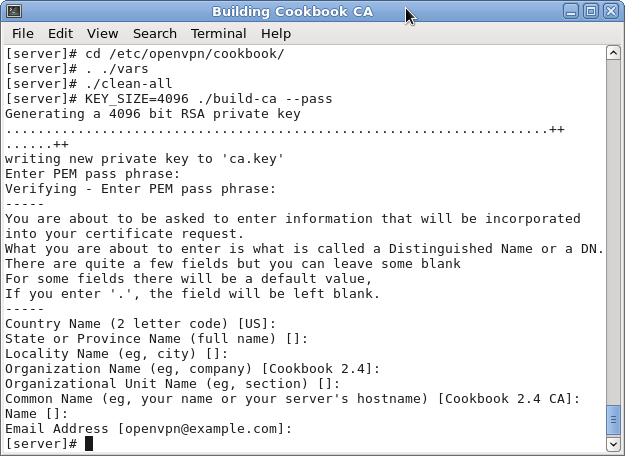

# Глава2. Клиент-серверные сети только по IP

Мы рассмотрим следующие темы:

* Настройка публичных и приватных ключей
* Простая конфигурация
* Серверная маршрутизация
* Добавление поддержки IPv6
* Использование файлов `client-config-dir` 
* Маршрутизация - подсети с обоими направлениями
* Перенаправление шлюза по умолчанию
* Перенаправление шлюза по умолчанию IPv6
* Использование блока `ifconfig-pool` 
* Использование файла состояния
* Интерфейс управления
* Proxy-агр

## Вступление

Рецепты в этой главе будут касаться наиболее часто используемой модели развертывания OpenVPN: один сервер с несколькими удаленными клиентами, способными маршрутизировать IP-трафик.

Мы также рассмотрим несколько распространенных конфигураций маршрутизации в дополнение к использованию интерфейса управления как на стороне клиента, так и на стороне сервера.

Последний рецепт этой главы покажет, как можно избежать использования сетевых мостов для большинства практических случаев использования.

Поскольку маршрутизируемая настройка в стиле TUN является наиболее часто используемой моделью развертывания - некоторые примеры конфигурационных файлов, представленные в этой главе, будут повторно использоваться в остальной части книги. В частности, это файлы конфигурации типа `basic-udp-server.conf`, `basic-udp-client.conf`, `basic-tcp-server.conf`, а также `basic-tcp-client.conf` из рецепта _Маршрутизации на стороне сервера_ будут часто использоваться повторно, а также файлы конфигурации клиента Windows `basic-udp-client.ovpn` и `basic-tcp-клиент.ovpn` из рецепта _Использование блока ifconfig-pool_.

## Настройка публичных и приватных ключей

Прежде чем мы сможем настроить VPN для режима клиент-сервер - нам нужно настроить инфраструктуру открытых ключей (PKI). PKI включает в себя центр сертификации, приватные ключи и сертификаты (публичные ключи) как для клиента, так и для сервера. Нам также нужно создать файл параметров Диффи-Хеллмана, который необходим для идеальной секретности.

Для настройки PKI мы используем скрипт `easy-rsa`. Эти скрипты изначально поставлялись вместе с самим дистрибутивом OpenVPN, но в настоящее время они также могут быть загружены и установлены отдельно.

### Подготовка

PKI должен быть установлен на доверенном компьютере. Это может быть тот же самый компьютер, на котором запущен сервер OpenVPN, но с точки зрения безопасности лучше всего, если PKI будет полностью отделена от остальных служб OpenVPN. Одним из вариантов является хранение ключа центра сертификации PKI на внешнем диске, который подключается только по необходимости. Другой вариант - хранить закрытый ключ CA на отдельном компьютере, который вообще не подключен к какой-либо сети.

Этот рецепт был создан на Linux, но он также может быть повторен на компьютере Mac OS. В Windows команды очень похожи. Скрипты Linux легко запускаются из оболочки, похожей на bash, поэтому вам обязательно нужно использовать csh/tcsh (оболочка UNIX).

### Как это сделать...
1. Создайте каталоги для PKI и скопируйте дистрибутив easy-rsa из вашей установки OpenVPN:
```
$ mkdir -m 700 -p /etc/openvpn/cookbook/keys
$ cd /etc/openvpn/cookbook
$ cp -drp /usr/share/easy-rsa/2.0/* .
```

---

**Примечание**

Обратите внимание, что нет необходимости запускать эти команды от имени пользователя root, при условии, что пользователю разрешено создать указанный выше путь к каталогу.

---

2. Затем мы настроили файл `vars`. Создайте файл, содержащий следующее:

```
export EASY_RSA=/etc/openvpn/cookbook
export OPENSSL="openssl"
export PKCS11TOOL="pkcs11-tool"
export GREP="grep"
export KEY_CONFIG=`$EASY_RSA/whichopensslcnf $EASY_RSA`
export KEY_DIR="$EASY_RSA/keys"
export PKCS11_MODULE_PATH="dummy"
export PKCS11_PIN="dummy"
export KEY_SIZE=2048
export CA_EXPIRE=3650
export KEY_EXPIRE=1000
export KEY_COUNTRY="US"
export KEY_PROVINCE=
export KEY_CITY=
export KEY_ORG="Cookbook 2.4"
export KEY_OU=
export KEY_CN=
export KEY_EMAIL="openvpn@example.com"
```

---

**Примечание**

Обратите внимание, что записи `PKCS11_MODULE_PATH` и `PKCS11_PIN` необходимы, даже если вы не используете смарт-карты.
Также обратите внимание, что некоторые переменные `KEY_` имеют пустое значение. Это необходимо для генерации сертификатов в пакете, как мы увидим далее.
`KEY_SIZE` по умолчанию 2048 бит достаточно безопасен в течение следующих нескольких лет. Больший размер ключа (4096 бит) возможен, но компромисс - это штраф за производительность. Мы создадим 4096-битный закрытый ключ CA, так как производительность здесь не является проблемой.
Настройте параметры (`KEY_ORG`, `KEY_OU`, `KEY_EMAIL`), чтобы они отражали вашу организацию. Значение этих настроек будет объяснено более подробно позже.

---

3. Получите файл `vars` и сгенерируйте закрытый ключ CA и сертификат, используя 4096-битный модуль. Выберите надежный пароль для сертификата CA. После этого просто нажимайте клавишу Enter каждый раз, когда скрипт запрашивает ввод данных:

```
$ cd /etc/openvpn/cookbook
$ . ./vars
$ ./clean-all
$ KEY_SIZE=4096 ./build-ca --pass
```

Пример вывода показан на следующем снимке экрана:


